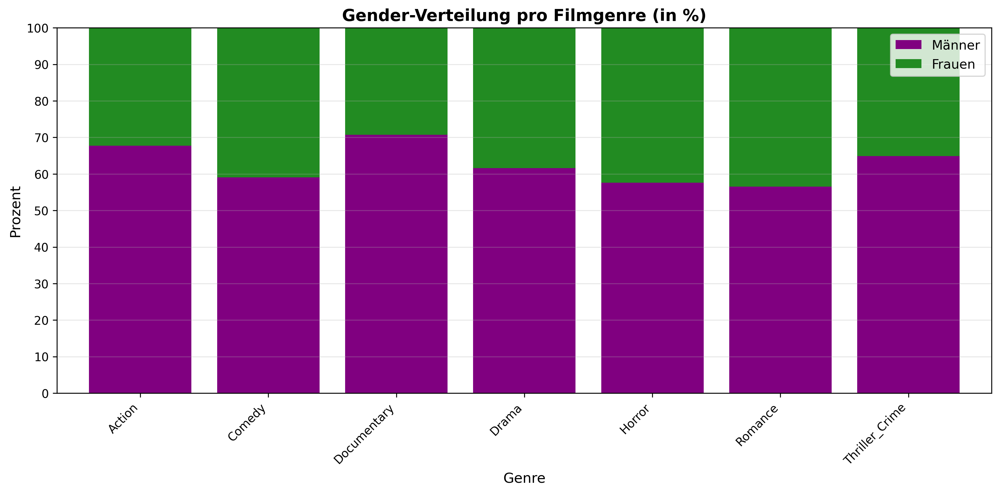
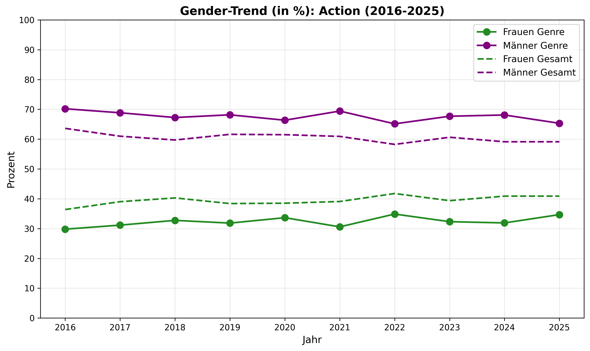
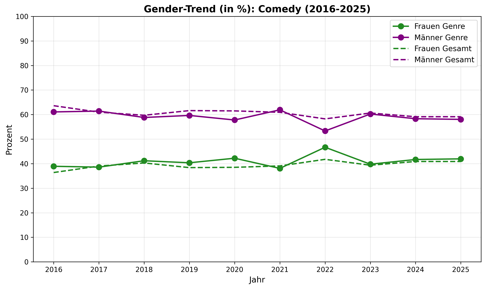
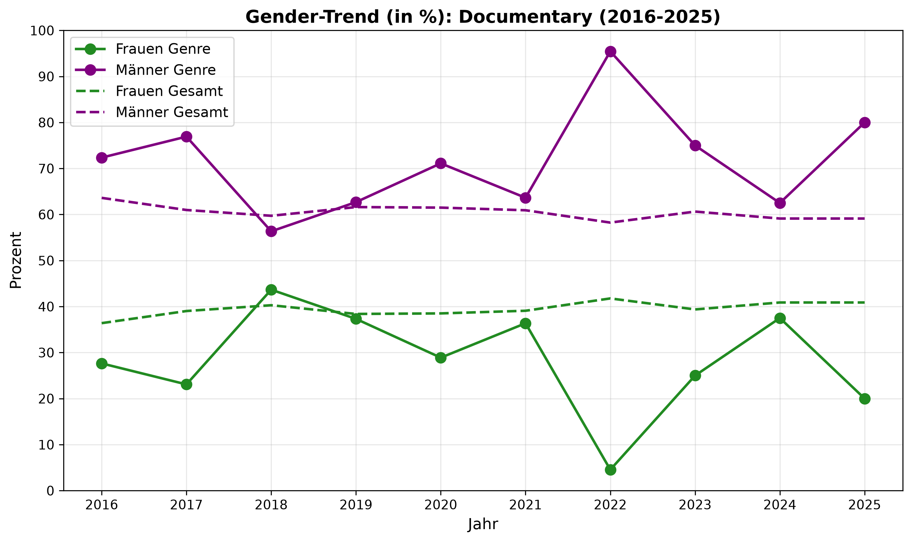
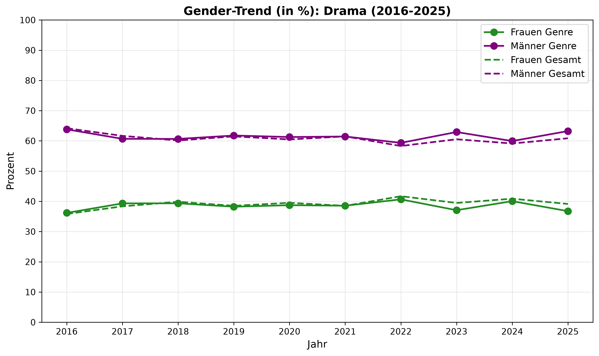
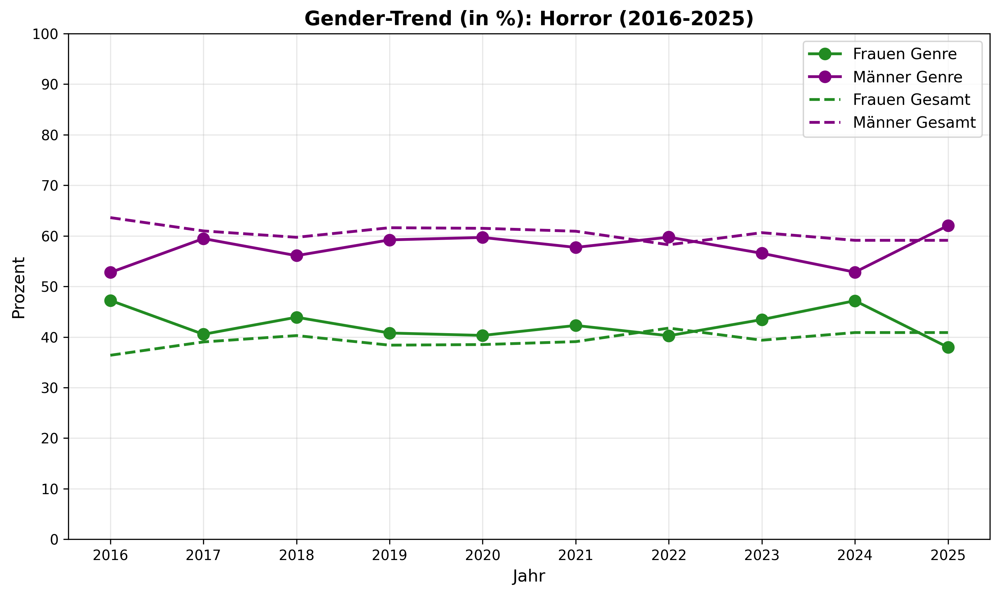
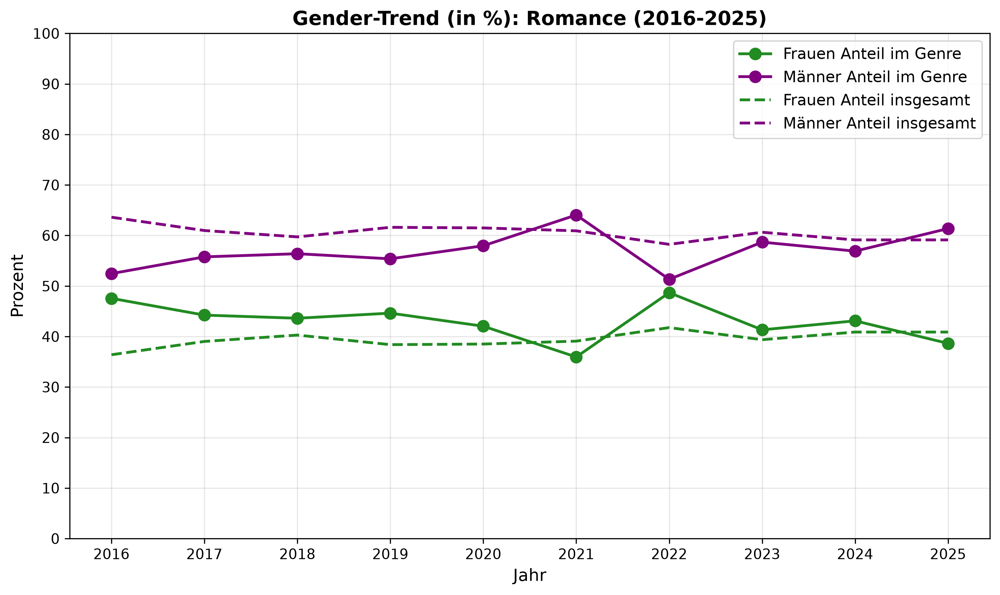
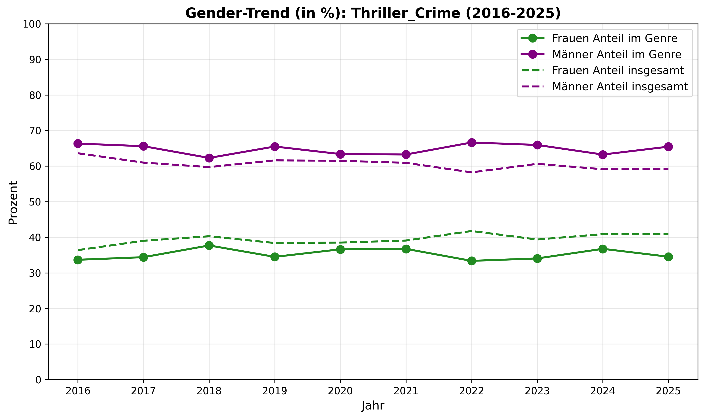
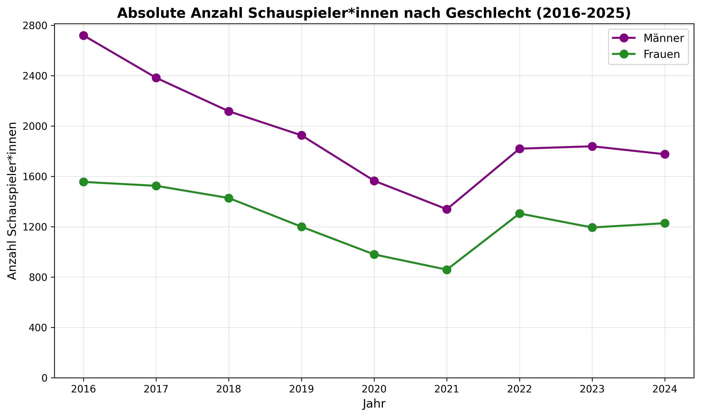

---
quarto render gender_im_film.qmd --to pdf---
title: "Geschlecht und Genre: Eine WikiData-Analyse zur Repräsentation von Schauspieler*innen in US-Filmproduktionen (2016–2025)"
author: "Vorname Nachname"
date: today
format:
  html:
    toc: true
    toc-depth: 3
    toc-title: "Inhaltsverzeichnis"
    number-sections: true
    theme: cosmo
    code-fold: true
    code-summary: "Code anzeigen"
  pdf:
    toc: true
    toc-depth: 3
    number-sections: true
    documentclass: scrartcl
    geometry:
      - margin=2.5cm
    include-in-header:
      text: |
        \usepackage{setspace}
        \onehalfspacing
lang: de
bibliography: references.bib
---

```{python}
#| include: false
from pathlib import Path
import sys

sys.path.insert(0, str(Path.cwd() / "src"))

from process import load_and_process_data
from visualize import create_bar_chart, create_line_charts, create_absolute_line_chart

PROJECT_ROOT = Path.cwd()
DATA_RAW_2   = PROJECT_ROOT / "data_raw_2"
DATA_RAW_1   = PROJECT_ROOT / "data_raw_1"
OUTPUT_DIR   = PROJECT_ROOT / "output"
OUTPUT_CHARTS = OUTPUT_DIR / "charts"
```

# Einleitung

## Motivation

Wer im Kino sitzt und auf die Leinwand schaut, sieht nicht die Welt – sondern eine kuratierte Version davon. Seit Beginn der Filmgeschichte bestimmen strukturelle Ungleichheiten, welche Geschichten erzählt werden, wer sie erzählt und wer darin sichtbar ist. Studien zeigen konsistent, dass Frauen im Film sowohl quantitativ als auch qualitativ unterrepräsentiert sind: Sie erhalten weniger Rollen, sprechen weniger Dialogzeilen und werden häufiger auf bestimmte Genres beschränkt [@smith2019].

Diese Ungleichheit ist kein Zufall. Sie ist das Ergebnis historisch gewachsener Machtstrukturen, die bestimmen, wessen Perspektive als „normal" gilt – und wessen nicht. Caroline Criado Perez beschreibt dies als den **Gender Data Gap**: die systematische Lücke, die entsteht, wenn Frauen in Daten, Studien und gesellschaftlichen Normen unsichtbar bleiben [@criadoperez2019].

## Fragestellung

Diese Analyse untersucht, ob und wie stark sich die Genreverteilung von Schauspielerinnen und Schauspielern in US-Filmproduktionen unterscheidet – und wie sich dieser Unterschied zwischen 2016 und 2025 entwickelt hat. Dabei wird WikiData sowohl als Datenquelle als auch als Untersuchungsgegenstand betrachtet: Fehlende oder unvollständige Einträge können selbst ein Indiz für strukturellen Bias sein.

**Leitfrage:** Sind Schauspielerinnen in US-Filmproduktionen systematisch auf bestimmte Genres konzentriert – und spiegelt WikiData diesen Bias wider oder verstärkt es ihn?

## Theoretischer Hintergrund

### Gender Data Gap

Caroline Criado Perez prägt den Begriff des **Gender Data Gap** für das Phänomen, dass Frauen in Datenerhebungen systematisch untererfasst werden [@criadoperez2019]. Der Gap äußert sich auf vier Ebenen:

- **Fehlende Daten:** Frauen werden in Studien und Statistiken seltener erfasst, was zu verzerrten Stichproben führt.
- **Fehlende Variablen:** Geschlechtsspezifische Unterschiede werden bei Datenerhebungen nicht berücksichtigt.
- **Fehlende Datensätze:** Ganze Lebensbereiche von Frauen – z.B. unbezahlte Care-Arbeit – werden nicht erhoben.
- **Nicht differenzierte Daten:** Daten werden erhoben, aber nicht nach Geschlecht getrennt ausgewertet, wodurch Unterschiede unsichtbar bleiben.

Übertragen auf WikiData bedeutet dies: Wenn Schauspielerinnen weniger oder unvollständigere Einträge haben als ihre männlichen Kollegen, ist das nicht nur eine technische Lücke – es ist ein strukturelles Problem, das reale Ungleichheiten reproduziert und verstärkt.

### Der männliche Prototyp und Medien

Der Soziologe Raewyn Connell beschreibt, wie **hegemoniale Männlichkeit** zur unhinterfragten gesellschaftlichen Norm wird [@connell1995]. Historische Machtstrukturen – von Bildung über Politik bis Wissenschaft, traditionell von Männern dominiert – haben dazu geführt, dass die männliche Perspektive als universell gilt. Kultur und Medien spielen dabei eine zentrale Rolle: Mythen, Religionen und Unterhaltungsmedien stellen überwiegend männliche Figuren ins Zentrum. Das Männliche wird zur **unausgesprochenen Norm** – nicht weil es repräsentativer wäre, sondern weil hauptsächlich eine Perspektive dokumentiert und institutionalisiert wurde.

Im Film zeigt sich das konkret: Actionheld*innen, Protagonist*innen in Thrillern und Kriegsfilmen sind historisch männlich konnotiert, während Frauen in „emotionalen" Genres wie Romance oder Drama überrepräsentiert sind.

### Data Feminism

D'Ignazio und Klein entwickeln in **Data Feminism** (2020) ein Rahmenwerk, das Datenanalyse als politische Praxis begreift [@dignazio2020]. Ihre Kernbotschaft: *Daten(-analysen) sind nicht neutral, sondern spiegeln Machtstrukturen wider und sollten bewusst inklusiv und gerecht gestaltet werden.*

Für diese Analyse ist besonders das Prinzip **„Examine Power"** relevant: Wer entscheidet, welche Daten in WikiData eingetragen werden? Wessen Karriere wird dokumentiert, wessen nicht? Die Antworten auf diese Fragen sind nie technisch neutral, sondern eingebettet in gesellschaftliche Machtverhältnisse.

### Matrix of Domination

Patricia Hill Collins' **Matrix of Domination** beschreibt, wie Unterdrückung auf vier Ebenen gleichzeitig wirkt [@collins1990]:

| Domäne | Beschreibung | Bezug zum Film |
|------------------------|------------------------|------------------------|
| Structural | Unterdrückung durch Gesetze und Politiken | Fehlende Quotenregelungen in der Filmindustrie |
| Disciplinary | Verwaltung von Unterdrückung durch Institutionen | Casting-Strukturen, Studiopolitiken |
| Hegemonic | Legitimation durch Ideologie, Kultur, Medien | Genres als codierte Rollenerwartungen |
| Interpersonal | Alltägliche Diskriminierungserfahrungen | Typecasting, ungleiche Gage |

Für unsere Analyse ist besonders die **Hegemonic Domain** relevant: Genres sind keine neutralen Kategorien – sie transportieren kulturelle Erwartungen darüber, welche Geschichten „männlich" oder „weiblich" sind.

### Intersektionalität

Kimberlé Crenshaw betont, dass Diskriminierung selten eindimensional ist [@crenshaw1989]. Geschlecht überlagert sich mit Ethnizität, Klasse, Alter und weiteren Faktoren. Diese Analyse kann Intersektionalität aufgrund der WikiData-Datenlage (Geschlecht ist die einzige systematisch erfasste Kategorie) nicht vollständig abbilden – dies ist eine bewusst reflektierte Limitation und selbst Ausdruck des Gender Data Gap.

# Daten und Methode

## Datenquelle: WikiData

WikiData ist eine freie, kollaborative Wissensdatenbank, die strukturierte Daten für Wikipedia und andere Projekte der Wikimedia Foundation bereitstellt. Inhalte werden als sogenannte *Items* (Entitäten mit eindeutiger Q-ID) und *Properties* (Eigenschaften mit P-ID) organisiert und können über die Abfragesprache SPARQL ausgewertet werden [@vrandecic2014].

Als Datenquelle für diese Analyse bietet WikiData mehrere Vorteile: freie Verfügbarkeit, maschinenlesbare Struktur und eine große Abdeckung von Filmproduktionen und Personen. Gleichzeitig ist WikiData kein vollständiges Abbild der Filmindustrie – die Qualität der Einträge hängt von der Community ab, die sie pflegt, und ist damit selbst ein Ausdruck der oben beschriebenen Machtstrukturen.

## Stichprobe

### Vorauswahl der Genres

Um aus den hunderten in WikiData erfassten Genrebezeichnungen eine sinnvolle Auswahl zu treffen, wurde zunächst die Häufigkeit der wichtigsten Genres in US-Filmen seit 2016 ermittelt:

``` sparql
SELECT ?genreLabel (COUNT(?film) AS ?anzahl)
WHERE {
  ?film wdt:P31 wd:Q11424 ;
        wdt:P577 ?datum ;
        wdt:P136/rdfs:label ?genreLabel .
  FILTER(YEAR(?datum) >= 2016)
  FILTER(LANG(?genreLabel) = "en")
}
GROUP BY ?genreLabel
ORDER BY DESC(?anzahl)
LIMIT 20
```

Auf Basis dieser Häufigkeiten wurden die sieben relevantesten Kategorien identifiziert (mit geschätzten Filmzahlen ab 2016):

| Genre-Gruppe     | Enthaltene WikiData-Genres                   | ca. Filme |
|------------------|-------------------------------------|------------------|
| Drama            | drama film, biographical film, comedy drama  | \~22.300  |
| Documentary      | documentary film                             | \~12.200  |
| Action           | action film, adventure film, sci-fi, fantasy | \~8.700   |
| Thriller & Crime | thriller film, crime film, mystery film      | \~7.700   |
| Comedy           | comedy film                                  | \~7.800   |
| Horror           | horror film                                  | \~3.200   |
| Romance          | romance film, romantic comedy film           | \~2.900   |

### Hauptabfrage

Für jedes Jahr von 2016 bis 2025 wurde folgende SPARQL-Abfrage einzeln ausgeführt und als CSV exportiert (Jahreszahl entsprechend angepasst):

``` sparql
SELECT DISTINCT ?person ?personLabel ?genderLabel
                ?film ?filmLabel ?genre ?genreLabel ?year
WHERE {

  -- Vorfilterung: nur Personen mit mehr als 4 US-Filmen im jeweiligen Jahr
  {
    SELECT ?person (COUNT(DISTINCT ?film) AS ?filmCount)
    WHERE {
      ?person wdt:P106 wd:Q33999 ;
              wdt:P21  ?gender .
      ?film   wdt:P161 ?person ;
              wdt:P495 wd:Q30 ;
              wdt:P577 ?date ;
              wdt:P136 ?genre .
      FILTER(YEAR(?date) = [JAHR])
      FILTER(?genre IN (
        wd:Q130232, wd:Q157443, wd:Q2484376, wd:Q188473,
        wd:Q319221, wd:Q24925,  wd:Q157394,  wd:Q369747,
        wd:Q959790, wd:Q2743,   wd:Q200092,  wd:Q853630,
        wd:Q1200678, wd:Q1361932, wd:Q1339864, wd:Q846544,
        wd:Q17013749
      ))
      FILTER(?gender IN (wd:Q6581072, wd:Q6581097))
    }
    GROUP BY ?person
    HAVING(?filmCount > 4)
  }

  ?person wdt:P21  ?gender .
  ?film   wdt:P161 ?person ;
          wdt:P136 ?genre ;
          wdt:P495 wd:Q30 ;
          wdt:P577 ?date .
  BIND(YEAR(?date) AS ?year)
  FILTER(?year = [JAHR])
  FILTER(?genre IN (
    wd:Q130232, wd:Q157443, wd:Q2484376, wd:Q188473,
    wd:Q645928, wd:Q319221, wd:Q24925,   wd:Q93204,
    wd:Q157394, wd:Q369747, wd:Q959790,  wd:Q2743,
    wd:Q200092, wd:Q853630, wd:Q1200678, wd:Q1361932,
    wd:Q1339864, wd:Q846544, wd:Q17013749
  ))
  FILTER(?gender IN (wd:Q6581072, wd:Q6581097))
  SERVICE wikibase:label { bd:serviceParam wikibase:language "en" }
}
```

Zusätzlich wurde pro Jahr eine aggregierte Abfrage ohne Genre-Aufschlüsselung ausgeführt, die nur die Gesamtzahl an Schauspieler\*innen je Geschlecht liefert. Diese dient in den Zeitreihen-Diagrammen als Referenzlinie für den allgemeinen Trend.

## Datenaufbereitung

Die Rohdaten liegen als CSV-Dateien vor: `data_raw_1/` enthält pro Jahr die genrebezogenen Daten, `data_raw_2/` die aggregierten Gesamtzahlen. Die Aufbereitung erfolgt modular über `process.py`:

- **Genre-Mapping:** Verwandte Einzelgenres werden zu sieben übergeordneten Kategorien zusammengefasst (konfiguriert in `config.py`).
- **Aggregation:** Absolute Schauspieler\*innen-Zahlen pro Jahr, Genre und Geschlecht sowie normalisierte prozentuale Anteile.
- **Referenztrend:** Gesamtanteil männlich/weiblich pro Jahr aus `data_raw_2/`, als Vergleichslinie in den Genre-Zeitreihen.

```{python}
#| label: datenaufbereitung

df_processed_pct, df_processed_abs, year_counts, overall_share_df = \
    load_and_process_data(DATA_RAW_2, DATA_RAW_1)

# Überblick Stichprobe
summary = df_processed_abs.groupby("genderLabel")["actorCount"].sum().reset_index()
summary.columns = ["Geschlecht", "Gesamtanzahl (alle Jahre, alle Genres)"]
summary
```

## Methodische Einschränkungen

Folgende Limitierungen sind bei der Interpretation zu berücksichtigen:

- **Selektivität von WikiData:** Nur Personen mit Wikipedia-Einträgen sind erfasst. Weniger bekannte Schauspieler\*innen – und der Forschungsstand legt nahe, dass das überproportional Frauen betrifft – fehlen systematisch.
- **Binäre Geschlechtskategorisierung:** WikiData erfasst Geschlecht binär (männlich/weiblich). Nicht-binäre Personen sind kaum repräsentiert, was die Analyse auf diese zwei Kategorien beschränkt.
- **Mindestfilmanzahl:** Der Filter auf mehr als 4 Filmkredits erhöht die Datenqualität, schließt aber Personen mit kürzeren oder diskontinuierlichen Karrieren aus – auch das kann genderspezifisch sein.
- **Intersektionalität:** Weitere Dimensionen wie Ethnizität oder Alter konnten aufgrund fehlender Daten nicht berücksichtigt werden (vgl. @crenshaw1989).

# Ergebnisse

## Gesamtverteilung der Stichprobe

*\[Nach dem Ausführen des Codes: Kurze Beschreibung wie viele Schauspielerinnen vs. Schauspieler insgesamt in der Stichprobe sind und was das Verhältnis bedeutet.\]*

```{python}
#| label: abb-grundverteilung
#| fig-cap: "Abbildung 1: Gender-Verteilung pro Filmgenre über alle Jahre (2016–2025, in %)"

create_bar_chart(df_processed_abs, OUTPUT_CHARTS / "gender_by_genre.png")
```



## Genreverteilung nach Geschlecht

*\[Hier: Welche Genres sind am stärksten von Männern dominiert? In welchen Genres sind Frauen überproportional vertreten? Bezug zu den theoretischen Konzepten: Hegemonic Domain (Collins), männlicher Prototyp.\]*

## Genre-Trends im Zeitverlauf (2016–2025)

*\[Hier: Pro Genre beschreiben wie sich der Frauen-/Männeranteil über die Jahre entwickelt hat. Die gestrichelte Linie zeigt den Gesamt-Trend – weicht ein Genre davon ab? Gibt es Verbesserungen oder Verschlechterungen?\]*

```{python}
#| label: abb-genre-trends

num_charts = create_line_charts(
    df_processed_pct, OUTPUT_CHARTS, overall_share_df=overall_share_df
)
```

::: {layout-ncol="2"}













:::

## Absolute Entwicklung

*\[Hier: Wächst die Gesamtzahl der Schauspieler\*innen in der Stichprobe? Wächst sie für beide Geschlechter gleichermaßen?\]*

```{python}
#| label: abb-absolut
#| fig-cap: "Abbildung 3: Absolute Anzahl Schauspieler*innen nach Geschlecht (2016–2025)"

create_absolute_line_chart(year_counts, OUTPUT_CHARTS / "absolute_gender_trend.png")
```



# Diskussion

## Interpretation der Ergebnisse

*\[Hier die konkreten Befunde aus Kapitel 4 aufgreifen und interpretieren. Beispiele für mögliche Argumente:\]*

Die Ergebnisse bestätigen, was feministische Medienforschung bereits länger dokumentiert: Genres sind keine neutralen Kategorien, sondern kulturell codierte Räume mit impliziten Geschlechtererwartungen. Im Sinne von Collins' **Hegemonic Domain** legitimieren diese Erwartungen die Ungleichverteilung, ohne dass sie explizit als Diskriminierung erkennbar wäre [@collins1990]. Action- und Kriegsfilme gelten kulturell als „männliche" Genres – dass Schauspielerinnen dort untervertreten sind, erscheint dann nicht als Ausschluss, sondern als natürliches Ergebnis von Präferenzen.

D'Ignazio und Klein würden darauf hinweisen, dass diese scheinbare Natürlichkeit selbst ein Produkt von Machtstrukturen ist [@dignazio2020]: Wenn die Mehrheit derjenigen, die Castingentscheidungen treffen, männlich ist (Disciplinary Domain nach Collins), reproduzieren sich bestehende Muster.

## Einordnung im Kontext des Gender Data Gap

Besonders relevant ist, was die Daten **nicht** zeigen können. WikiData selbst ist ein Ausdruck des Gender Data Gap nach Criado Perez [@criadoperez2019]: Einträge entstehen dort, wo Community-Mitglieder Relevanz wahrnehmen – und diese Wahrnehmung ist nicht geschlechtsneutral. Studien zu Wikipedia – der eng mit WikiData verbundenen Plattform – zeigen, dass Frauen deutlich seltener eigene Artikel erhalten und bestehende Artikel kürzer und lückenhafter sind [@wagner2015].

Dies bedeutet: Die Stichprobe dieser Analyse ist bereits gefiltert. Schauspielerinnen, die WikiData nicht erfasst, sind überproportional jene mit kürzeren, weniger dokumentierten Karrieren – genau die Gruppe, deren Unterrepräsentation besonders relevant wäre. Der **Gender Data Gap zeigt sich damit nicht nur im Film, sondern auch in den Daten, mit denen wir ihn untersuchen**.

## Reflexion von Limitationen

Neben den methodischen Einschränkungen aus Kapitel 3.4 sind zwei konzeptuelle Grenzen zu benennen:

**Binäre Geschlechtskategorisierung:** Die Analyse arbeitet mit einer binären Klassifikation, die WikiDatas Datenstruktur folgt. Aus intersektionaler Perspektive (Crenshaw) ist dies unzureichend: Nicht-binäre und genderdiverse Schauspieler\*innen bleiben unsichtbar, und die Erfahrungen von Frauen unterschiedlicher Herkunft, Klasse oder sexueller Orientierung werden unter einer einheitlichen Kategorie „weiblich" subsumiert [@crenshaw1989].

**Kausalität vs. Korrelation:** Die Analyse zeigt Muster, kann aber keine Ursachen belegen. Ob Schauspielerinnen weniger Action-Rollen erhalten, weil sie nicht gecastet werden, weil sie nicht auditionieren, oder weil weniger Action-Filme mit weiblichen Hauptrollen produziert werden – das lässt sich mit WikiData allein nicht klären.

## Fazit

Diese Analyse zeigt, dass Geschlechterunterschiede in der Genreverteilung von Schauspieler\*innen in US-Filmproduktionen auch in WikiData messbar sind. *\[Hier konkrete Hauptbefunde zusammenfassen.\]*

Aus der Perspektive des Data Feminism ist der vielleicht wichtigste Befund nicht das, was die Daten zeigen – sondern das, was sie nicht zeigen können. WikiData ist kein Spiegel der Filmindustrie, sondern eine kuratierte, von gesellschaftlichen Machtverhältnissen geprägte Repräsentation davon. Eine datenbasierte Analyse von Genderungleichheit trägt damit immer das Risiko, den Gender Data Gap zu reproduzieren, den sie zu untersuchen versucht.

Für zukünftige Analysen wäre eine Verbindung mit zusätzlichen Quellen – etwa Daten des Geena Davis Institute on Gender in Media oder der USC Annenberg Inclusion Initiative – wünschenswert, um ein vollständigeres Bild zu erhalten.

# Literaturverzeichnis

::: {#refs}
:::